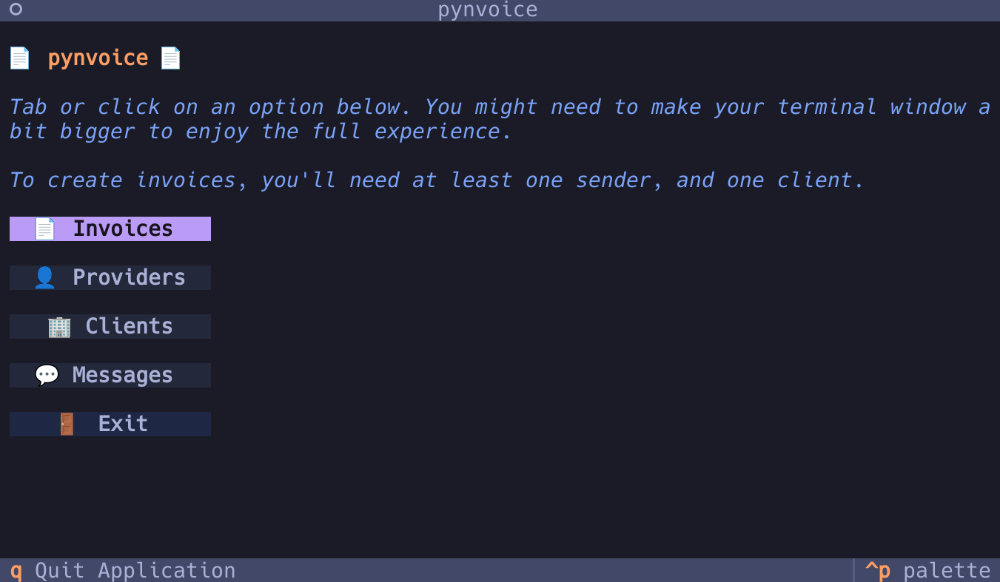
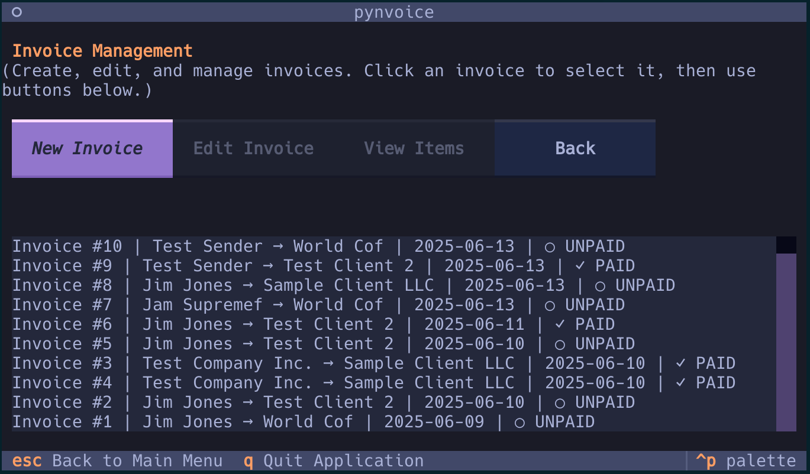

# Pynvoice 📄

> Simple terminal-based invoice generation with PDF export

Pynvoice is a lightweight, terminal-based invoice management application built with Python and Textual. Create professional invoices directly from your command line with an intuitive TUI interface.

## Screenshots

### Home Screen



### Invoice Management



## Features

- **🏢 Provider Management** - Manage your business information and sender details
- **👤 Client Management** - Store and organize client information
- **📄 Invoice Creation** - Generate professional invoices with line items
- **💬 Footer Messages** - Add custom messages to your invoices
- **📤 PDF Export** - Export invoices as PDF files for sharing
- **🎨 Modern TUI** - Clean terminal interface with Tokyo Night theme
- **💾 SQLite Database** - Local data storage with no external dependencies

## Installation

1. Clone the repository:

```bash
git clone https://github.com/GVPproj/pynvoice.git
cd pynvoice
```

2. Install dependencies:

```bash
pip install -r requirements.txt
```

3. Run the application:

```bash
python app.py
```

## Usage

1. **Set up a Provider** - Add your business information first
2. **Add Clients** - Create client records with contact details
3. **Create Invoices** - Generate invoices with line items and totals
4. **Export PDFs** - Save invoices as professional PDF documents

Navigate using Tab/Shift+Tab or click with your mouse. Press `q` to quit at any time.

## Requirements

- Python 3.7+
- textual
- sqlite3 (built-in)
- Additional dependencies listed in `requirements.txt`

## TODO

### Refactor

- context7 mcp
- rename provider functions (from senders)
- add j and k navigation
- clients, footer messages and invoice screens to new folder structure modelled by provider
- move number input fields on to same row (input type number?)
- add delete functionality to lists for senders, clients, invoices
- mimic solarized osaka theme
